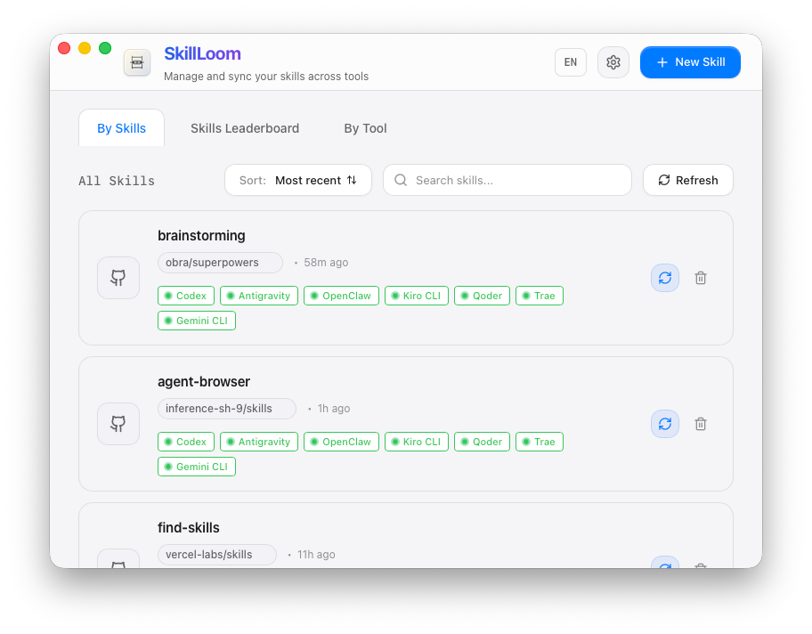
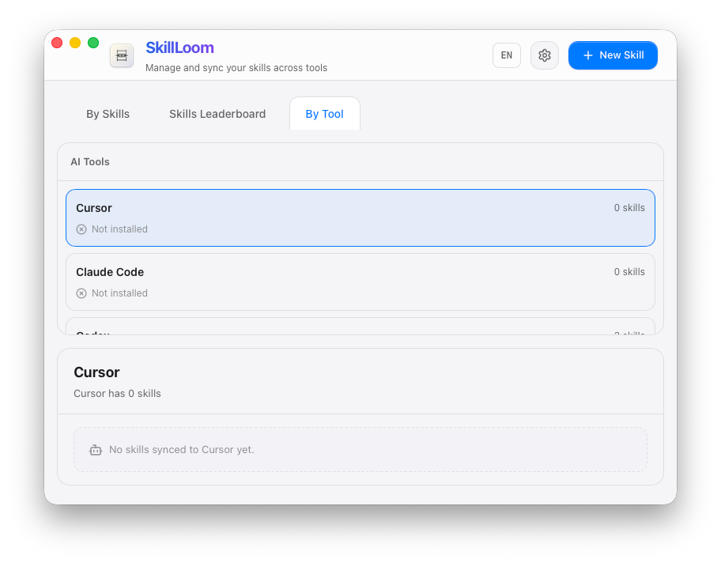
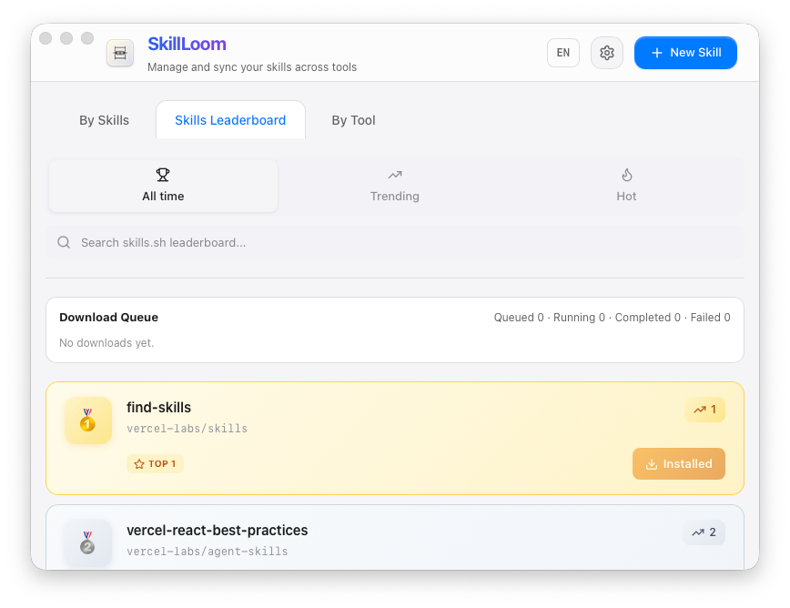

# SkillLoom (Tauri Desktop)

A cross-platform desktop app (Tauri + React) to manage Agent Skills in one place and sync them to multiple AI coding tools’ global skills directories (prefer symlink/junction, fallback to copy) — “Install once, sync everywhere”.


## Key Features

- Three core tabs: `By Skills`, `By Tool`, and `Leaderboard`
- Leaderboard install flow: browse/search skills.sh, then install with download queue + status
- Onboarding migration: scan existing skills in installed tools, import into the Central Repo, and sync
- Import sources: local folder / Git URL (including multi-skill repo selection)
- Update & sync: refresh from source and propagate updates to copy-mode targets
- New tool detection: detect newly installed tools and prompt to sync managed skills

## Screenshots





## Supported AI Coding Tools

| tool key | Display name | skills dir (relative to `~`) | detect dir (relative to `~`) |
| --- | --- | --- | --- |
| `cursor` | Cursor | `.cursor/skills` | `.cursor` |
| `claude_code` | Claude Code | `.claude/skills` | `.claude` |
| `codex` | Codex | `.codex/skills` | `.codex` |
| `opencode` | OpenCode | `.config/opencode/skills` | `.config/opencode` |
| `antigravity` | Antigravity | `.gemini/antigravity/global_skills` | `.gemini/antigravity` |
| `amp` | Amp | `.config/agents/skills` | `.config/agents` |
| `kimi_cli` | Kimi Code CLI | `.config/agents/skills` | `.config/agents` |
| `augment` | Augment | `.augment/rules` | `.augment` |
| `openclaw` | OpenClaw | `.openclaw/skills` | `.openclaw` |
| `cline` | Cline | `.cline/skills` | `.cline` |
| `codebuddy` | CodeBuddy | `.codebuddy/skills` | `.codebuddy` |
| `command_code` | Command Code | `.commandcode/skills` | `.commandcode` |
| `continue` | Continue | `.continue/skills` | `.continue` |
| `crush` | Crush | `.config/crush/skills` | `.config/crush` |
| `junie` | Junie | `.junie/skills` | `.junie` |
| `iflow_cli` | iFlow CLI | `.iflow/skills` | `.iflow` |
| `kiro_cli` | Kiro CLI | `.kiro/skills` | `.kiro` |
| `kode` | Kode | `.kode/skills` | `.kode` |
| `mcpjam` | MCPJam | `.mcpjam/skills` | `.mcpjam` |
| `mistral_vibe` | Mistral Vibe | `.vibe/skills` | `.vibe` |
| `mux` | Mux | `.mux/skills` | `.mux` |
| `openclaude` | OpenClaude IDE | `.openclaude/skills` | `.openclaude` |
| `openhands` | OpenHands | `.openhands/skills` | `.openhands` |
| `pi` | Pi | `.pi/agent/skills` | `.pi` |
| `qoder` | Qoder | `.qoder/skills` | `.qoder` |
| `qwen_code` | Qwen Code | `.qwen/skills` | `.qwen` |
| `trae` | Trae | `.trae/skills` | `.trae` |
| `trae_cn` | Trae CN | `.trae-cn/skills` | `.trae-cn` |
| `zencoder` | Zencoder | `.zencoder/skills` | `.zencoder` |
| `neovate` | Neovate | `.neovate/skills` | `.neovate` |
| `pochi` | Pochi | `.pochi/skills` | `.pochi` |
| `adal` | AdaL | `.adal/skills` | `.adal` |
| `kilo_code` | Kilo Code | `.kilocode/skills` | `.kilocode` |
| `roo_code` | Roo Code | `.roo/skills` | `.roo` |
| `goose` | Goose | `.config/goose/skills` | `.config/goose` |
| `gemini_cli` | Gemini CLI | `.gemini/skills` | `.gemini` |
| `github_copilot` | GitHub Copilot | `.copilot/skills` | `.copilot` |
| `clawdbot` | Clawdbot | `.clawdbot/skills` | `.clawdbot` |
| `droid` | Droid | `.factory/skills` | `.factory` |
| `windsurf` | Windsurf | `.codeium/windsurf/skills` | `.codeium/windsurf` |

## Development

### Prerequisites

- Node.js 18+ (recommended: 20+)
- Rust (stable)
- Tauri system dependencies (follow Tauri official docs for your OS)

```bash
npm install
npm run tauri:dev
```

### Build

```bash
npm run lint
npm run build
npm run tauri:build
```

#### Platform build commands (from `package.json`)

- macOS (dmg): `npm run tauri:build:mac:dmg`
- macOS (universal dmg): `npm run tauri:build:mac:universal:dmg`
- Windows (MSI): `npm run tauri:build:win:msi`
- Windows (NSIS exe): `npm run tauri:build:win:exe`
- Windows (MSI+NSIS): `npm run tauri:build:win:all`
- Linux (deb): `npm run tauri:build:linux:deb`
- Linux (AppImage): `npm run tauri:build:linux:appimage`
- Linux (deb+AppImage): `npm run tauri:build:linux:all`

### Tests (Rust)

```bash
cd src-tauri
cargo test
```


## FAQ / Notes

- Where are skills stored? The Central Repo defaults to `~/.skillloom` (configurable in Settings).
- Why is Cursor sync always copy? Cursor currently does not support symlink/junction-based skill directories, so SkillLoom forces directory copy when syncing to Cursor.
- Why does sync sometimes fall back to copy? SkillLoom prefers symlink/junction, but on some systems (especially Windows) symlinks may be restricted; in that case it falls back to directory copy.
- What does `TARGET_EXISTS|...` mean? The target folder already exists and the operation did not overwrite it (default is non-destructive). Remove the existing folder or retry with the appropriate overwrite flow.
- macOS Gatekeeper note (unsigned/notarized builds, may vary by macOS version): if you see “damaged” or “unverified developer”, run `xattr -cr "/Applications/SkillLoom.app"` (https://v2.tauri.app/distribute/#macos).

## Supported Platforms

- macOS (verified)
- Windows (expected by design; not validated locally)
- Linux (expected by design; not validated locally)

## License

MIT License — see `LICENSE`.
